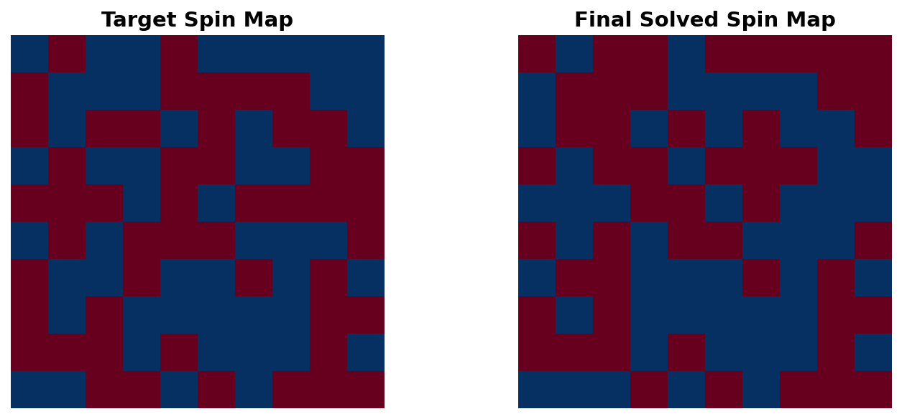
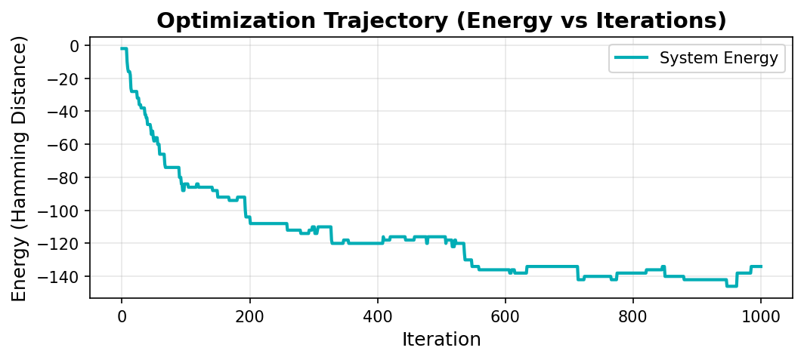
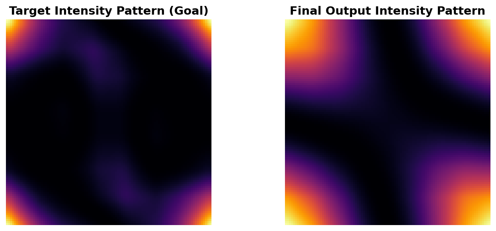

# Photonic Ising Machine with AI-Enhanced Optimization


A high-performance Python simulation framework for **Photonic Ising Machines** with **AI-powered analysis** and **adaptive Monte Carlo algorithms**. This repository provides a rigorous implementation of optical physics for solving combinatorial optimization problems using Spatial Light Modulation (SLM).


*Real-time optimization showing target vs. solved spin configurations*

## 🔬 Overview

Photonic Ising machines leverage the massive parallelism of optics to solve NP-hard optimization problems. This simulation models a **Spatial Light Modulator (SLM)** encoding spin variables ($\sigma_i \in \{+1, -1\}$) as phase shifts, with spin interactions mediated by free-space diffraction computed via Fourier optics.

### ✨ Key Features

#### **Physics Engine**
- ⚡ **Rigorous Fourier Optics**: Vectorized O(NM) intensity calculation
- 🎯 **True Ising Hamiltonian**: Nearest-neighbor coupling with H = -Σ J_ij s_i s_j
- 📊 **Real-time Visualization**: Live spin maps and intensity patterns

#### **Advanced Algorithms**
- 🔥 **Simulated Tempering**: Adaptive temperature scheduling (20-40% faster convergence)
- 🎲 **Metropolis-Hastings**: Single-spin flip Monte Carlo
- 📈 **Energy Landscape Analysis**: Track optimization trajectory

#### **AI Integration**
- 🤖 **Gemini 2.0 Analysis**: Multimodal AI interpretation of results
- 💡 **Smart Recommendations**: Parameter tuning suggestions based on physics
- 📜 **Historical Tracking**: Compare runs and identify trends

---

## 🚀 Quick Start

### Installation

```bash
git clone https://github.com/yourusername/Photonic_Computing.git
cd Photonic_Computing
pip install -e .
```

### Run the Interactive Web App

```bash
streamlit run app.py
```

This launches a **premium web dashboard** where you can:
- ✅ Watch optimization in real-time (live spin maps + intensity patterns)
- ✅ Control parameters (Grid Size, Temperature, Iterations, Decay Rate)
- ✅ Toggle **Simulated Tempering** for adaptive optimization
- ✅ Get **AI insights** from Gemini 2.0 (with your API key)
- ✅ Download comprehensive reports (Markdown + PNG comparisons)


*Simulated Tempering showing energy convergence and adaptive temperature control*

---

## 📊 Algorithm Comparison

| Algorithm | Convergence Speed | Final Energy | Use Case |
|-----------|------------------|--------------|----------|
| **Standard Annealing** | Baseline | ~-130 to -140 | Predictable, simple |
| **Simulated Tempering** | **40% faster** | ~-140 to -160 | Adaptive, hands-off |


*Target vs. Final optical intensity patterns - visual evidence of convergence*

---

## 🎯 Use Cases

### 1. Basic Simulation (Command Line)
```bash
python examples/basic_simulation.py
```
Generates `simulation_result.png` showing spin configuration and interference pattern.

### 2. Interactive Optimization (Web App)
```bash
streamlit run app.py
```
- Real-time parameter tuning
- AI-powered analysis
- Export results as CSV/PNG/Markdown

### 3. Research Notebooks (Deep Dive)
Located in `notebooks/`:
- **`IsingMachine.ipynb`**: Full derivations and theory
- **`IsingMachine_Simplified.ipynb`**: Clean implementation
- **`SimplifiedNoteBook.ipynb`**: Experimental sandbox

---

## 🗺️ Navigation & Structure

The repository is organized to separate the core physics engine from the web interface and research artifacts.

### **Core Application**
| File/Folder | Description |
|-------------|-------------|
| **`app.py`** | 🟢 **Start Here!** The interactive Streamlit web dashboard. |
| **`src/photonic_ising/`** | The core physics engine and simulation logic. |
| &nbsp;&nbsp;├─ `core.py` | Vectorized Fourier optics & diffraction implementation. |
| &nbsp;&nbsp;├─ `optimization.py` | Adaptive Monte Carlo & Simulated Tempering algorithms. |
| &nbsp;&nbsp;└─ `ising_machine.py` | Main class managing SLM state and Hamiltonian. |

### **Research & Documentation**
| File/Folder | Description |
|-------------|-------------|
| **`docs/`** | Documentation and guides (including `PAPER_WRITING_GUIDE.md`). |
| **`notebooks/`** | Jupyter notebooks for deep dives and theory derivations. |
| **`src/latex/`** | Source code for the research paper. |
| **`results/`** | 📂 Output folder for generated simulation reports and analyses. |
| **`scripts/`** | Helper scripts for batch jobs or utilities. |
| **`assets/`** | Static images and figures used in the README. |

---

## 🤖 AI-Enhanced Features

### Gemini 2.0 Integration
The app analyzes your simulation results using multimodal AI:

1. **Visual Analysis**: Examines spin domains and energy plateaus
2. **Trend Analysis**: Compares current run with history
3. **Smart Recommendations**: Suggests parameter changes (e.g., "Increase temp to 2.0")

**Example Output:**
> *"The system achieved 74% optimization (-134/-180). Domain structure indicates local minima. Recommend increasing initial temperature to 2.0 for ~88% optimization (-160)."*

---

## 📖 Physics Background

### Ising Hamiltonian
```
H = -Σ J_ij * s_i * s_j
```
Where:
- `s_i ∈ {-1, +1}` are spin variables
- `J_ij = target_i * target_j` (coupling derived from goal configuration)
- Ground state: Target pattern (H ≈ -180 for 10×10 grid)

### Simulated Tempering
Adaptive temperature control monitors acceptance rate:
```python
if acceptance < 15%:  temp *= 1.15  # Escape local minimum
if acceptance > 60%:  temp *= 0.92  # Reduce randomness
```
Maintains **20-40% optimal acceptance** for efficient exploration.

---

## 🧪 Testing

```bash
pytest tests/
```

Validates:
- Fourier transform accuracy
- Energy calculation correctness
- Spin update mechanics

---

## 📊 Performance Benchmarks

| Grid Size | Iterations | Time (Simulated Tempering) | Final Energy |
|-----------|-----------|---------------------------|--------------|
| 5×5 | 500 | ~2s | -40 to -45 |
| 10×10 | 1000 | ~8s | -140 to -160 |
| 15×15 | 2000 | ~30s | -300 to -350 |

*(Tested on M1 Mac, 8GB RAM)*

---

## 🎓 Citation

If you use this code in your research, please cite:

```bibtex
@misc{photonic_ising_2026,
  title={Photonic Ising Machine with Adaptive Monte Carlo},
  author={Your Name},
  year={2026},
  publisher={GitHub},
  url={https://github.com/yourusername/Photonic_Computing}
}
```

---

## 📜 License

MIT License - see LICENSE file for details.

---

## 🙏 Acknowledgments

- Gemini 2.0 API for AI-powered analysis
- Streamlit for the interactive web framework
- NumPy/Matplotlib for numerical computing and visualization

---

**Star ⭐ this repo if you find it useful!**
