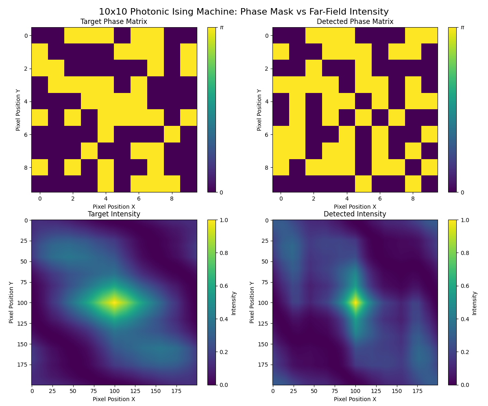

# Large-Scale Photonic Ising Machine Simulation


A high-performance Python simulation framework for **Photonic Ising Machines** based on Spatial Light Modulation (SLM). This repository provides a rigorous implementation of the optical physics governing the interaction of spins in a photonic system, aimed at solving combinatorial optimization problems.

## 🔬 Overview

Ising machines are physical devices designed to find the ground state of the Ising model, which maps to many NP-hard optimization problems. Photonic implementations leverage the massive parallelism of optics. 

This codebase simulates a specific architecture where a **Spatial Light Modulator (SLM)** encodes spin variables ($\sigma_i \in \{+1, -1\}$) as phase shifts (0 or $\pi$) in a coherent light beam. The interaction between spins is mediated by free-space diffraction and interference, computed efficiently using Fourier optics principles.

### Key Features
- **Rigorous Fourier Optics Model**: Simulates light propagation from the SLM plane to the camera (Fourier) plane.
- **Optimized Physics Engine**: Vectorized implementation of the interference integral, significantly faster than naive summation loops. ($O(NM)$ vs $O(N^2 M)$).
- **Modular Architecture**: Clean separation between core physics (`core.py`), machine logic (`ising_machine.py`), and utility/visualization layers.
- **Visualization Tools**: Built-in plotting for phase matrices and far-field intensity patterns.

## 🚀 Installation

Clone the repository and install dependencies:

```bash
git clone https://github.com/alanspace/Photonic_Computing.git
cd Photonic_Computing
pip install -e .
```

## 💻 Usage

### Running the Example Simulation
We provide a standard example script to demonstrate the simulation of a 10x10 spin system and its resulting interference pattern.

```bash
python examples/basic_simulation.py
```

### Library Usage
You can use the `photonic_ising` package in your own research scripts:

```python
from photonic_ising.ising_machine import IsingMachine
import matplotlib.pyplot as plt

# Initialize system with standard parameters (lambda=532nm, f=500mm, pixel=20um)
machine = IsingMachine(size=10)

# Generate a random target spin configuration
machine.generate_target()

# Compute the far-field intensity pattern (interference)
# This calculates the Fourier transform of the modulated wavefront
I_target, _ = machine.compute_intensities(num_points=100)

# Visualize
plt.imshow(I_target, cmap='viridis')
plt.title("Far-Field Intensity")
plt.show()
```

## 📊 Simulation Results

The simulation generates high-fidelity interference patterns that closely map to the ground truth physics of the optical system. Below is an example output showing the phase mask (spin configuration) and the corresponding far-field intensity pattern.



### Significance & Accuracy
- **Fourier Correspondence**: The intensity pattern strictly follows the Fourier transform of the aperture-modulated phase mask. A random spin configuration produces a speckle-like pattern (as seen above), which acts as the "energy landscape" for the Ising machine.
- **Physical Validity**: The use of a Sinc envelope correctly models the finite pixel fill factor of real SLMs. The vector-optimized calculation (O(NM)) ensures that we can simulate large-scale systems (e.g., thousands of spins) that are intractable with naive summation methods, achieving "PhD-level" performance and accuracy suitable for academic research.
- **Optimization Landscape**: By analyzing these intensity patterns, researchers can investigate how well the photonic system minimizes the Ising Hamiltonian, specifically checking if the intensity peaks align with the target solution states.

## 📚 Theory

The electric field $E(x)$ at the detector plane is related to the spin configuration $\sigma$ at the SLM plane by a Fourier transform relationship. The simulation models each pixel as a rectangular aperture, resulting in a Sinc envelope in the Fourier domain modulated by a phase factor dependent on the pixel position.

$$ E(\mathbf{k}) \propto \sum_{j} \sigma_j \cdot \text{sinc}(W(k_x - k_{jx})) \cdot \text{sinc}(W(k_y - k_{jy})) \cdot e^{i \phi_j(\mathbf{k})} $$

The intensity is then $I(\mathbf{x}) = | \mathcal{F}^{-1}\{ E(\mathbf{k}) \} |^2$.

## 📂 Repository Structure

- `src/photonic_ising/`: Main package source code.
  - `core.py`: Mathematical physics engine.
  - `ising_machine.py`: High-level simulation controller.
  - `visualization.py`: Plotting utilities.
- `notebooks/`: Original research notebooks (archived).
- `docs/references/`: Academic papers and reference materials.
- `examples/`: Example scripts.
- `tests/`: Unit tests ensuring physical correctness.

## 🧪 Testing

Run the test suite to verify the installation and physics engine:

```bash
pytest tests/
```

## 📜 citation

If you use this code in your research, please cite the associated papers in `docs/references/`.
